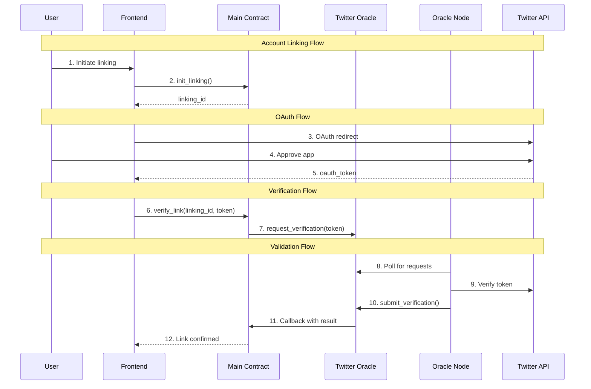

# NEAR Twitter Account Linking System

A decentralized system for linking Twitter accounts to NEAR accounts using smart contracts and oracles.

## Project Structure

```
twitter-linking/
├── crates/
│   ├── social-linking/          # Main social linking library
│   ├── twitter-oracle-contract/ # Twitter oracle contract
│   └── twitter-oracle-node/     # Validator service (Oracle Node)
└── frontend/                    # Vite + React frontend
```

## Prerequisites

- [NEAR CLI](https://docs.near.org/tools/near-cli#setup)
- [Rust](https://rustup.rs/)
- [Node.js](https://nodejs.org/)
- [Bun](https://bun.sh/)
- Twitter Developer Account with OAuth 2.0 credentials

## Setup

1. **Install Dependencies**

```bash
# Install Rust target for NEAR contracts
rustup target add wasm32-unknown-unknown

# Install project dependencies
bun install
```

2. **Configure Environment Variables**

Create `frontend/.env`:

```env
VITE_TWITTER_CLIENT_ID=your_twitter_client_id_here
```

Create `crates/twitter-oracle-node/.env`:

```env
ACCOUNT_ID=your-oracle.near
PRIVATE_KEY=your_private_key_here
CONTRACT_ID=twitter-oracle.near
```

## Components

### Twitter Oracle Contract

Handles the verification of Twitter accounts:

- Processes verification requests for Twitter accounts
- Maintains secure mappings between Twitter and NEAR accounts
- Provides query methods for account linkage status
- Integrates with the oracle node for verification

### Twitter Oracle Node (Validator)

A Rust service that:

- Monitors the oracle contract for verification requests
- Verifies Twitter OAuth tokens using Twitter's API
- Submits verification results back to the contract
- Provides robust error handling and logging
- Implements automatic retries for failed verifications

### Frontend

React application built with Vite that provides:

- NEAR wallet integration
- Twitter OAuth flow
- Account linking interface
- Real-time verification status updates

## Development

1. **Build Contracts**

```bash
cd crates/twitter-oracle-contract
cargo build --target wasm32-unknown-unknown
```

2. **Start Oracle Node**

```bash
cd crates/twitter-oracle-node
cargo run
```

3. **Run Frontend**

```bash
cd frontend
bun run dev
```

## Security Considerations

1. **Token Security**
   - OAuth tokens are only stored temporarily
   - All API calls use HTTPS
   - Tokens are cleared after verification

2. **Rate Limiting**
   - Oracle node implements request throttling
   - Monitors Twitter API usage
   - Handles API errors gracefully

3. **Error Handling**
   - Timeout mechanisms in place
   - Retry strategies implemented
   - Clear error messages provided

## System Flow



## License

MIT
